<!-- Futuristic Cyberpunk GitHub Profile README for Prakhar Shukla -->

<!-- Interactive Animated Holographic Header Banner (Terminal & Info Embedded inside SVG) -->

  

---

### 🛠️ Languages and Grid Tools

  <table border="0" cellpadding="8" cellspacing="5">
    <!-- Category 1: Languages -->
    <tr>
      <td align="right"><b>[ LANGUAGES ]</b></td>
      <td>
        &nbsp;
        &nbsp;
        
      </td>
    </tr>
    <!-- Category 2: Frontend -->
    <tr>
      <td align="right"><b>[ FRONTEND ]</b></td>
      <td>
        &nbsp;
        &nbsp;
        
      </td>
    </tr>
    <!-- Category 3: Backend & DB -->
    <tr>
      <td align="right"><b>[ BACKEND &amp; DB ]</b></td>
      <td>
        &nbsp;
        &nbsp;
        &nbsp;
        
      </td>
    </tr>
    <!-- Category 4: Systems & Tools -->
    <tr>
      <td align="right"><b>[ CORE SYSTEM &amp; IIOT ]</b></td>
      <td>
        &nbsp;
        &nbsp;
        
      </td>
    </tr>
  </table>

---

### 🌐 Cyber Net Connections

  
  &nbsp;&nbsp;&nbsp;&nbsp;
  
  &nbsp;&nbsp;&nbsp;&nbsp;
  

---

### 📊 System Diagnostics & Cyber Stats

  <table border="0" cellpadding="5" cellspacing="5" width="100%">
    <tr>
      <!-- Column 1: GitHub Stats Mirror (Using high-reliability endpoints) -->
      <td width="50%" valign="top" align="center">
        <h4>[ GITHUB PROTOCOLS ]</h4>
        <!-- Mirror endpoint for maximum reliability -->
        
          
        
      </td>
      <!-- Column 2: LeetCode & GitHub Activity ECG Graph -->
      <td width="50%" valign="top" align="center">
        <h4>[ LEETCODE &amp; LANGUAGES ]</h4>
        
          
        <!-- Stable mirror for languages -->
        
      </td>
    </tr>
    <!-- Full-Width Row: Cyber Signal ECG Graph -->
    <tr>
      <td colspan="2" align="center" style="padding-top: 15px;">
        <h4>[ RECENT HEARTBEAT SIGNAL ]</h4>
        <!-- Ultra-stable animated graph matching IIoT theme -->
        
      </td>
    </tr>
  </table>

---

### 📌 Holographic Quote of the Day

  

---

### 🎮 System Grid Activity

  

<!-- Glowing, highly reliable visitor badge that never fails -->

  

